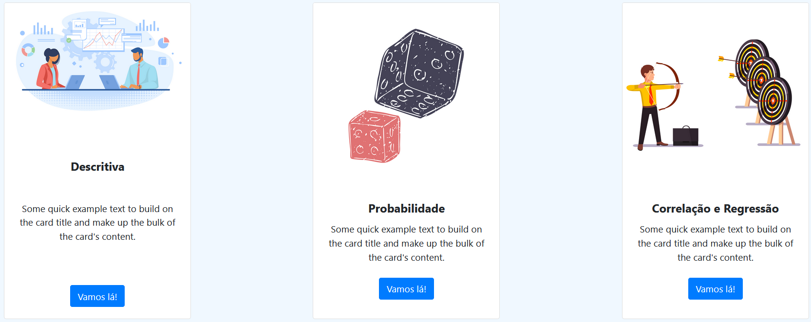

# Projeto de Estatística
> Projeto feito no 3º ciclo de ADS na Fatec Franca, abrangendo as matérias de Estatistica Aplicada, Engenharia de Software e Estrutura de Dados. Feito em Javascript, Html, Css e Bootstrap.

[Página do projeto](https://wainer97.github.io/Projeto-de-estatistica/)

Esse projeto tem como objetivo a coleta, organização, descrição, análise e interpretação de dados fornecidos pelo usuário. Esses dados envolvem em sua totalidade conchecimentos adquiridos na matéria de Estatística Aplicada, como medidas de tendência central, medidas separatrizes, medidas de dispersão, calculos de tabulação, enttre outros.

## Como usar:

Apenas clique aqui > (https://wainer97.github.io/Projeto-de-estatistica/)

## Quer nos ajudar a desenvolver: 

Siga as instruções em https://docs.github.com/pt/github/getting-started-with-github

## Meta

Wainer de Oliveira – [Github](https://github.com/wainer97)

Evandro Gomes - [Github](https://github.com/evandro-gomes)

Colocar licença. ex: Distribuido pela licença "taus" do ano taus e taus.

Imagens utilizadas:

background introdução, introdução :
Design by rawpixel.com / freepik

card (descritiva) :
https://br.freepik.com/fotos-vetores-gratis/negocio
Negócio vetor criado por pch.vector - br.freepik.com

card (probabilidade) :
https://br.freepik.com/fotos-vetores-gratis/icone
Ícone vetor criado por rawpixel.com - br.freepik.com

card(regressão linear):
https://br.freepik.com/fotos-vetores-gratis/fundo
Fundo vetor criado por iconicbestiary - br.freepik.com
